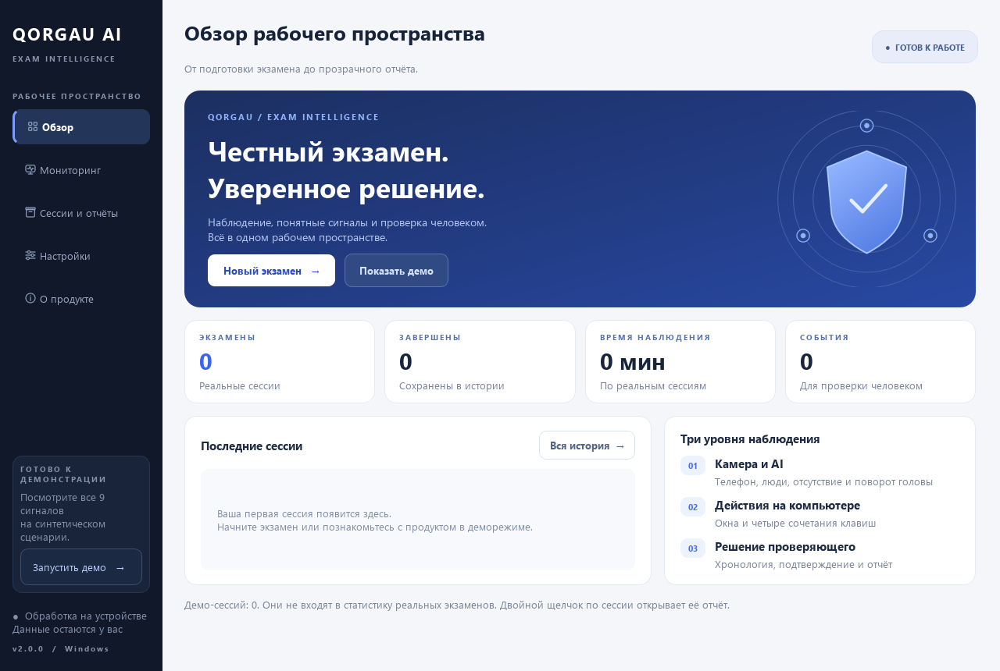
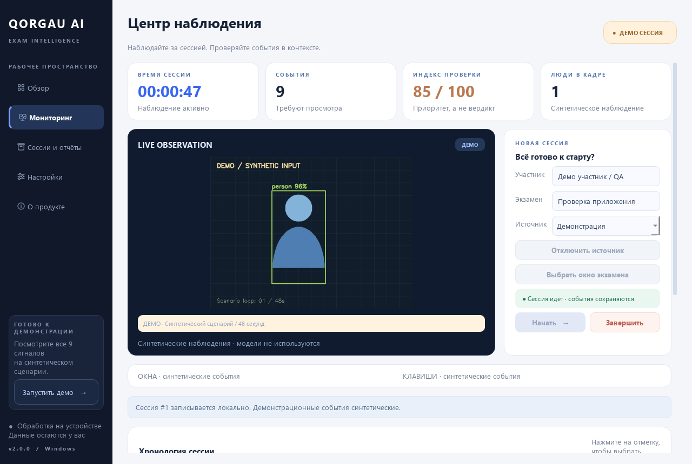

# QORGAU AI 2.0

Windows-приложение для локального наблюдения за экзаменом: Desktop UI → Webcam → YOLO11n + MediaPipe → Security Monitor → Risk/Event Engine → SQLite → Exam Report.

[Скачать Windows-приложение](https://github.com/NURIKZIX/qorgau-ai/releases/latest) · [Архив моделей для исходников](https://github.com/NURIKZIX/qorgau-ai/releases/download/v1.0.0/qorgau-ai-models-v1.0.0.zip)



## Рабочее пространство

- **Обзор:** новый стартовый экран, статистика реальных экзаменов и последние сессии. Демо не увеличивает показатели реальных экзаменов.
- **Мониторинг:** видеопоток, проверка готовности к старту, время и сигналы. Кнопки начала и завершения доступны на экране 1000×740.
- **Хронология:** цветные отметки событий; щелчок выбирает строку журнала. Доступны стрелки клавиатуры и таблица событий.
- **Журнал:** поиск по названию и деталям, фильтры камеры, клавиш, окон и технических событий.
- **Проверка:** прогресс решений, хронология, автосохранение вывода при вводе, смене сессии и закрытии. Экспорт отключён, пока сессия не выбрана.
- **Профили:** сбалансированный, меньше коротких сигналов, быстрая реакция. Профиль редактирует форму; применение — после сохранения и следующего подключения. Камера, уверенность моделей и выбор сохранения кадров сохраняются.
- **Демо в один клик:** кнопка «Показать демо» на обзоре заполняет только пустые поля и запускает синтетическую сессию. Активная сессия не заменяется демонстрацией.
- **Новый HTML-отчёт:** оформление в стиле продукта, хронология, прогресс проверки, адаптация к узкому экрану и печать в PDF средствами браузера.



Сценарий защиты проекта и приоритеты развития: [CONTEST_PLAN.md](docs/CONTEST_PLAN.md).

## Запуск готового приложения

Откройте `dist/QORGAU AI.exe`. Python, интернет и GPU для запуска не нужны: модели и зависимости включены в сборку. Первый запуск однофайловой сборки требует времени на распаковку. Нужны Windows 10/11 x64 и разрешение на доступ к камере.

При скачивании с GitHub откройте **Releases** и загрузите `QORGAU.AI.exe`. GitHub заменяет пробелы в имени файла точками. Рядом опубликован файл SHA-256. **Релиз v1.0.0 содержит пять исходных событий; новый интерфейс 2.0 и контроль клавиш находятся в текущих исходниках.** Для обновления запустите исходники или соберите новый EXE по инструкции ниже. Автоматическая проверка не подключает физическую веб-камеру и не нажимает клавиши в других приложениях.

1. Введите участника и экзамен. Нажмите **Подключить камеру** и дождитесь видеопотока.
2. Нажмите **Начать**: контроль клавиш включается автоматически, без закрепления окна. По умолчанию контролируется выход из QORGAU AI. Для экзамена во внешней программе предварительно нажмите **Выбрать окно экзамена** и за 5 секунд переключитесь в неё; вернитесь в QORGAU AI, начните экзамен и перейдите в закреплённое окно.
3. Нажмите **Завершить**. В разделе **Сессии и отчёты** выберите сессию, проверьте события, добавьте вывод и экспортируйте отчёт.

Для знакомства выберите **Демонстрация** и **Запустить демонстрацию**. Синтетический цикл длится 48 секунд и показывает все девять событий. Камера, модели и реальный перехват клавиш в этом режиме не используются. Сессии и отчёты явно помечены ДЕМО.

## Наблюдаемые события

| Сигнал | Источник | Задержка по умолчанию | Вес эпизода |
|---|---|---:|---:|
| Телефон | YOLO11n, класс COCO `cell phone` | 1.5 с | 20 |
| Несколько людей | ≥2 людей YOLO или ≥2 лиц MediaPipe | 2 с | 15 |
| Отсутствие человека | 0 людей и 0 лиц на доступном кадре | 5 с | 10 |
| Поворот головы | MediaPipe, абсолютный yaw ≥30° при одном лице | 3 с | 5 |
| Переключение окна | Windows foreground HWND отличается от QORGAU AI / закреплённого окна | 0 с; опрос 250 мс | 10 |
| Alt+Tab | Windows keyboard hook; также Alt+Shift+Tab | Сразу | 5 |
| Ctrl+C | Windows keyboard hook | Сразу | 5 |
| Ctrl+V | Windows keyboard hook; также Ctrl+Shift+V | Сразу | 5 |
| Print Screen | Windows keyboard hook; также с модификаторами | Сразу | 10 |
| Потеря камеры / ошибка | Недоступный или устаревший поток | Сразу | 0 |

Порог уверенности YOLO по умолчанию — 0.45 для человека и 0.25 для телефона. Раздельные значения выбраны после сравнения ONNX и исходной PyTorch-модели на размеченных изображениях COCO: телефоны часто имеют меньшую уверенность. Пороги и номер камеры меняются в настройках. Непрерывный сигнал создаёт один эпизод, возврат к норме закрывает его. При пропуске кадров более 2 секунд визуальные накопители сбрасываются. Временные отметки — монотонные смещения от начала сессии; календарные даты сохраняются в UTC.

Индекс проверки — сумма весов эпизодов, ограниченная 100. Это не вероятность нарушения и не автоматическая оценка участника. Исходный индекс остаётся воспроизводимым, включая отклонённые события; решения проверяющего хранятся отдельно.

Поворот головы не равен направлению взгляда. YOLO11n — стандартная модель COCO; маленький или закрытый телефон может не обнаруживаться. Освещение и положение камеры влияют на качество. Контроль окон обнаруживает переключение между окнами Windows, но не смену вкладки внутри одного браузерного окна. QORGAU AI тоже считается другим окном после привязки внешнего окна. Без привязки отслеживается выход из QORGAU AI. Уже сохранённая задержка окна сохраняется: для быстрого обнаружения установите в настройках **Переключение окна — задержка: 0 с**.

Клавиши контролируются только между началом и завершением реальной сессии, включая другие программы текущего рабочего стола Windows. Записываются вид сочетания и время, без введённого текста. Нажатие — сигнал для проверки, а не доказательство успешного копирования или снимка. Удержание не создаёт повторных событий; каждое новое нажатие создаёт новое событие. AltGr не считается Ctrl+C/V. Alt+Tab и выход из окна могут дать два разных сигнала. Сочетания не блокируются. При ошибке установки перехвата показывается сообщение и техническое событие с нулевым весом. Защищённый рабочий стол Windows (например, UAC) не наблюдается.

## Данные и отчёты

Рабочая папка — `%LOCALAPPDATA%/QorgauAI`:

- `qorgau.sqlite3`: сессии, снимок настроек, эпизоды, длительности, решения, комментарии.
- `settings.json`: настройки следующего подключения.
- `evidence/<session-id>/`: один JPEG при открытии визуального события, если пользователь включил эту опцию. По умолчанию кадры не сохраняются.
- `application.log`: диагностика ошибок.

Полная видеозапись не ведётся. Приложение не отправляет данные в сеть; не собирает введённый текст, содержимое экрана или буфера обмена. Во время экзамена записываются только четыре указанных типа сочетаний клавиш. Для изолированного тестирования доступна переменная `QORGAU_DATA_DIR`. При аварийном закрытии сессия помечается как прерванная при следующем запуске; длительность восстанавливается по последнему секундному heartbeat.

**HTML**: автономный отчёт с таблицей событий, решениями и комментарием; кнопка печати позволяет сохранить PDF средствами браузера. **CSV**: события в UTF-8 BOM. **JSON**: полная сессия, настройки и события. Кадры в HTML не встраиваются; их можно открыть отдельно из истории приложения.

## Разработка

Python 3.12 x64, PowerShell:

После клонирования скачайте [архив моделей](https://github.com/NURIKZIX/qorgau-ai/releases/download/v1.0.0/qorgau-ai-models-v1.0.0.zip) и распакуйте его содержимое в `models/`. В этой папке должны находиться `yolo11n.onnx`, `face_landmarker.task` и `manifest.json`. Модели не хранятся в Git; они опубликованы в релизе. Вместо скачивания подготовленных моделей можно выполнить экспорт по инструкции ниже.

```powershell
py -3.12 -m venv .venv
.\.venv\Scripts\python.exe -m pip install -r requirements-build.txt
.\.venv\Scripts\python.exe main.py
# или run.cmd
```

Для воспроизведения проверенной среды используйте `requirements-lock.txt`. В runtime используется ONNX Runtime CPU; PyTorch/Ultralytics нужны только для подготовки модели, в `.exe` они не включаются.

В VS Code откройте эту папку через **File → Open Folder**. В терминале достаточно выполнить `.\.venv\Scripts\python.exe main.py` — отдельная активация окружения не требуется. Для запуска клавишей **F5** установите расширение Microsoft Python и выберите конфигурацию **QORGAU AI** или **QORGAU AI — demo** из `.vscode/launch.json`. В Проводнике можно просто открыть `run.cmd`.

MediaPipe закреплена на 0.10.21: в проверке более новой 0.10.35 обнаружены обращения встроенной телеметрии ([обсуждение в upstream](https://github.com/google-ai-edge/mediapipe/issues/6291)). В Windows-сборке стартовый хук предварительно загружает `dateutil`, чтобы исключить конфликт импортов Qt и MediaPipe. Модели и камера открываются в фоновом потоке только после подключения источника.

### Подготовка моделей

```powershell
py -3.12 -m venv .export-venv
.\.export-venv\Scripts\python.exe -m pip install torch torchvision --index-url https://download.pytorch.org/whl/cpu
.\.export-venv\Scripts\python.exe -m pip install ultralytics onnx
.\.export-venv\Scripts\python.exe scripts\prepare_models.py
```

Скрипт скачивает официальные `yolo11n.pt` и `face_landmarker.task`, экспортирует YOLO11n в ONNX с входом 640×640 и записывает SHA-256 в `models/manifest.json`. Приложение не скачивает модели при запуске. Если они отсутствуют, реальный источник показывает ошибку; деморежим запускается только по явному выбору.

### Проверка и сборка

```powershell
.\.venv\Scripts\python.exe -m unittest discover -s tests -v
.\.venv\Scripts\python.exe main.py --self-test artifacts\source-smoke
powershell -ExecutionPolicy Bypass -File scripts\build.ps1 -OneFile
& '.\dist\QORGAU AI.exe' --self-test artifacts\exe-smoke
```

`--self-test` загружает обе реальные модели на пустом кадре, запускает Qt-интерфейс с демонстрационным источником, проверяет девять событий, SQLite, решения и три формата отчёта. В Windows проверяет установку и снятие реального keyboard hook с отключённой записью клавиш, сохранение очереди при завершении сессии и запрет событий вне сессии. Сохраняет `result.json` и снимки интерфейса, не подключая веб-камеру и не отправляя нажатия в другие приложения. Дополнительная проверка на официальных тестовых изображениях — `scripts/verify_models.py`. Обычная сборка без `-OneFile` создаёт portable-папку `dist/QORGAU AI`; её нужно копировать целиком.

## Структура

```text
main.py                 точка входа / диагностика
qorgau/ui.py            контроллер PySide6 Desktop UI
qorgau/screens.py       обзор, мониторинг, проверка и настройки
qorgau/design.py        стиль, векторная графика и временная шкала
qorgau/product.py       профили, фильтры и статистика
qorgau/worker.py        камера и фоновый поток; явный деморежим
qorgau/vision.py        YOLO11n ONNX + MediaPipe Face Landmarker
qorgau/security.py      контроль окна и четырёх сочетаний клавиш Windows
qorgau/engine.py        накопление, открытие и закрытие эпизодов
qorgau/storage.py       SQLite и восстановление сессий
qorgau/reports.py       HTML, CSV, JSON
scripts/                подготовка моделей, проверка и Windows-сборка
tests/                  пороги, пропуски кадров, база и экспорт
```

Документация интеграций: [YOLO11](https://docs.ultralytics.com/models/yolo11/), [экспорт ONNX](https://docs.ultralytics.com/modes/export/), [MediaPipe Face Landmarker](https://ai.google.dev/edge/mediapipe/solutions/vision/face_landmarker/python), [Qt for Python](https://doc.qt.io/qtforpython-6/).

Лицензия исходников: AGPL-3.0. Уведомления зависимостей и источники моделей — `THIRD_PARTY_NOTICES.md` и `models/README.md`.
